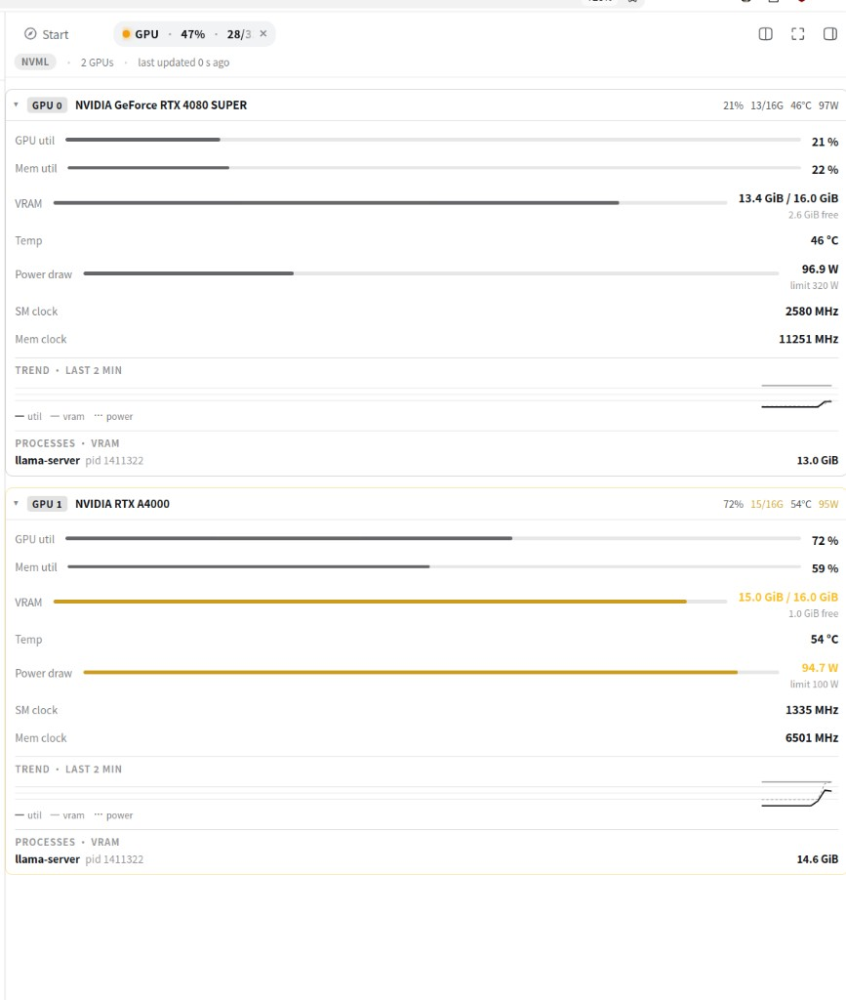
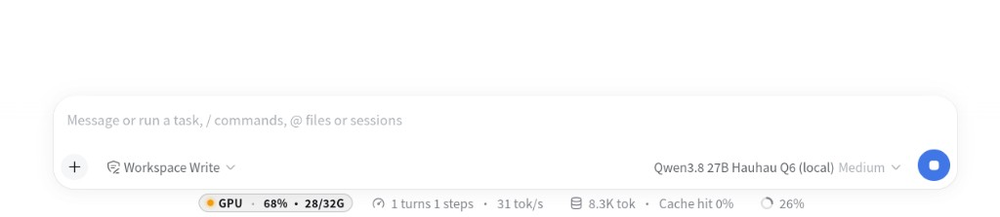
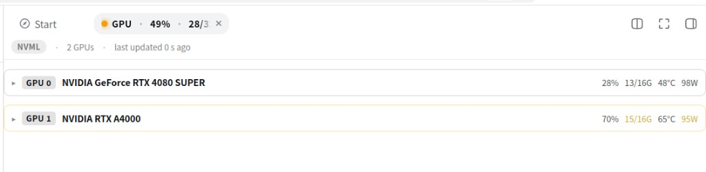

# dsh-gpu-monitor-nvml

A real-time multi-GPU monitor pane for the **DeepSeek Harness** web UI. One tab in the
right sidebar, one second per sample, every metric named — so a fleet of GPUs reads as
clearly as a dashboard instead of a raw dump.

Built and verified against live hardware: an NVIDIA RTX 4080 SUPER (index 0) and an
NVIDIA RTX A4000 (index 1), both visible in the pane simultaneously.

## Requirements

- **NVIDIA GPU + driver** only. AMD and Intel GPUs are not supported (no metrics).
- DeepSeek Harness web profile (`dsh web`).

### Platform support


| Platform | Metrics | Notes |
| --- | --- | --- |
| **Linux** | **NVML** (primary), `nvidia-smi` fallback | Fully supported |
| **Windows** | **`nvidia-smi`** (primary today) | `node-nvml` ships Linux binaries only; NVML used automatically if a Windows binding appears. Community testers welcome. |
| **macOS** | Stub only | No NVIDIA on modern Macs — not a real monitor target |


---

## Screenshots

Light theme, matching the DSH default.

| Pane open | Dock chip (pane closed) |
| --- | --- |
|  |  |

| Collapsed cards |
| --- |
|  |

If images fail to load, the ASCII mock below still conveys the layout.

## What you see

```
GPU Monitor  [NVML]   updated 1 s ago

GPU 0 · NVIDIA RTX 4080 SUPER
  GPU util      62 %      ▓▓▓▓▓▓▓▓░░
  Mem util      35 %      ▓▓▓▓░░░░░░
  VRAM          9.7 / 16 GiB   free 5.4 GiB   ▓▓▓▓▓▓▓▓▓░
  Power draw    261 W   limit 320 W   ▓▓▓▓▓▓▓░░░
  SM clock      2460 MHz   Mem clock 1313 MHz
  ── Trend · last 2 min ──
  ┌─────────────────────────────────┐
  │   util ───  vram ──  power ┈┈   │   3 series, 120 pts @ 1 Hz
  └─────────────────────────────────┘
  Processes · VRAM
    llama-server  pid 1113321   9.4 GiB

GPU 1 · NVIDIA RTX A4000
  ...
```

- **Every number has an unambiguous name.** "GPU util" (compute) is never confused with
"Mem util" (memory bus). VRAM shows used / total *and* free. Power shows draw and limit
as two named quantities. Clocks say "SM clock" and "Mem clock". Processes show name +
pid, VRAM in GiB.
- **Tooltips on every row** (`title`): what the metric is and where it comes from,
including the NVML-vs-smi "used" semantics (see *Data honesty* below).
- **Meter bars** on the four meterable rows (GPU util, Mem util, VRAM, Power draw) show
share of scale at a glance; a bar turns amber at ≥ 95 % of its scale.
- **Per-GPU 2-minute sparkline strip** — utilization trend, VRAM-occupancy trend, and
power-vs-limit trend on one shared 0–100 % scale. 120 points at 1 Hz, rolling window,
gap-aware pathing (a missing metric lifts the pen instead of drawing a false zero).
- **Realtime honesty**: 1 Hz polling, `no-store`, a source badge (`NVML` / `smi`),
"updated N s ago" in the fleet header, and per-GPU error notes. Stale data is marked
stale, never smoothed into a lie.

## Data honesty

The primary source on Linux is **NVML** via `node-nvml`, driven with raw C-FFI (a `js`-proxy
mangling of zero-arg out-pointer calls forced us to the raw API). Every field is sampled
in isolation: one failing metric reads as "no data" for that row, it never blanks the
GPU, and `sampleFleet()` never throws.

Two semantics worth knowing, both explained in tooltips:

- **NVML "used" ≠ nvidia-smi "used".** `memoryUsedMiB` is `total − free`, which
includes the driver/context reservation (~400–430 MiB on this hardware), so NVML reads
higher than nvidia-smi's process-based column. That is intentional; `memoryFreeMiB`
is exposed alongside for clarity.
- **Degraded mode is labeled.** If NVML is unavailable the host falls back to parsing
`nvidia-smi` and the pane shows an `smi` badge so you always know which source you're
looking at. On Windows this is the expected path today.

## Architecture

This is a **dual-face plugin package**: one npm package, two runtimes.

- **Host face** (`lib/index.js`, ESM) — registers the plugin, owns a 1 s sampling loop
(`SAMPLE_INTERVAL_MS = 1000`), and serves a JSON snapshot at
`GET /api/dsh-gpu-monitor` on the same origin as the page.
- **Client face** (`lib/client.js`, CJS closure factory) — loaded by the web client via
`window.__ModuleLoader__.load({ id, factory })`. Self-chaining 1 Hz `fetch` (no-store,
abortable), renders the pane into the right-sidebar tab slot, and keeps a per-GPU
rolling history buffer (capped at 120 points) that feeds the sparklines.
- **Glue** — `cordis.patch.yml` inserts one Loader row for the dual-face package; the
browser half is discovered from the `dsh.client` declaration in `package.json`.

Client constraints, honored: only frozen `PLATFORM_MODULES` may be required at runtime
(react, cordis, client store, ui slots/primitives/dockkit); everything else is inlined by
esbuild. Presentation is **inline styles only** — no CSS files in the bundle.

```
dsh-gpu-monitor-nvml/
├── package.json          # dual-face exports: "." (host) and "./client" (browser)
├── build.mjs             # esbuild, two configs (host ESM + client CJS closure factory)
├── cordis.patch.yml      # Loader row
├── media/                # README screenshots
├── src/
│   ├── host/
│   │   ├── index.ts      # plugin registration + sampling loop
│   │   ├── route.ts      # the exact route the client polls
│   │   ├── collect.ts    # NVML sampler (raw C-FFI, per-field isolation)
│   │   └── collect-smi.ts# labeled degraded fallback (Windows PATH / .exe)
│   ├── client/
│   │   ├── index.tsx     # slot injection
│   │   ├── GpuBody.tsx   # the pane: rows, meters, sparklines, history
│   │   └── GpuTitle.tsx  # tab chip
│   └── shared/
│       └── types.ts      # GpuSample / GpuFleetSnapshot / GpuProcess / round1
└── lib/                  # prebuilt output (committed for install-without-toolchain)
```

## Install

Requires **DeepSeek Harness** with a web profile and an **NVIDIA** driver
(`nvidia-smi` on PATH at minimum; NVML on Linux via `node-nvml`).

### From GitHub (users)

```sh
dsh plugin --profile web add github:janpauldahlke/dsh-gpu-monitor-nvml
# restart dsh web (or rely on live patch reload), then hard-refresh the browser
```

`lib/` is committed, so install does not require a local TypeScript/esbuild toolchain.

### From a git checkout (developers)

```sh
git clone https://github.com/janpauldahlke/dsh-gpu-monitor-nvml.git
cd dsh-gpu-monitor-nvml
npm install          # pulls node-nvml; prepare builds lib/ if toolchain present
node build.mjs       # optional: force rebuild → lib/index.js + lib/client.js

# wire into your web profile (absolute path; link: dep + bundle entry)
dsh plugin --profile web add "$PWD"
```

That updates `~/.dsh/profiles/web/package.json` roughly to:

```json
"dependencies": {
  "dsh-gpu-monitor-nvml": "link:/abs/path/to/dsh-gpu-monitor-nvml"
},
"dsh": {
  "profile": {
    "bundles": [
      "@deepseek-ai/dsh-base",
      "@deepseek-ai/dsh-web-app",
      "dsh-gpu-monitor-nvml"
    ]
  }
}
```

Restart `dsh web`, hard-refresh. The rightbar **GPU** tab and footer dock chip
should appear.

### Dev loop

```sh
# edit src/ → rebuild (profile already link:s this tree)
node build.mjs
# host half often hot-reloads with patchReload: live; client half: hard-refresh
```

If the profile cannot resolve the package name:

```sh
ln -sfn "$PWD" "$HOME/.dsh/profiles/web/node_modules/dsh-gpu-monitor-nvml"
```

Do **not** link only into a harness monorepo `node_modules` — Cordis resolves from
the **profile**.

### Verify

```sh
dsh --profile web --dump-config | grep -E 'gpu-monitor|dsh-gpu-monitor-nvml'
curl -s http://127.0.0.1:3080/api/dsh-gpu-monitor | head   # adjust port
# expect JSON: ok, source ("nvml"|"smi"), gpus[]
```

Remove:

```sh
dsh plugin --profile web remove dsh-gpu-monitor-nvml
```

## How this was built

Not a one-shot codegen demo. Roughly **a day of closed-loop iteration** on live
hardware: research the DSH plugin contract, scaffold, hit NVML through raw C-FFI,
break things, fix them, polish the pane (named metrics, meters, sparklines), and
re-check every pass on a dedicated acceptance port — without touching sacred
ports (`:3080` main dsh, `:8080` llama-server, `:11434` ollama). The result is
small, depends only on `node-nvml` at runtime, and labels where every number
came from.

### Authors

Built as a **human ↔ local-model pair**, not “AI did it” and not “human only
reviewed.”

- **Jan (hagbardCeline)** — software engineer. Set the goal and constraints,
steered architecture and honesty rules (NVML vs smi, never lie about stale
data), drove the accept/reject loop against real GPUs, killed bad paths,
and owned the final “ship this” call. Taste is part of that job; so is
engineering judgment across many hours of iteration.
- **Qwen3.8 27B Q6 HauHau** (coauthor) — wrote the bulk of the implementation
under that loop: host sampler, client UI, build glue. Served by llama.cpp,
tensor-split (`-ts 1,1`) across the same two cards this plugin monitors —
RTX 4080 SUPER + RTX A4000. In the pane, `llama-server` is the coauthor
thinking.
- **Hardware** — Ryzen 7 7800X3D, 61 GiB RAM, dual 16 GiB NVIDIA GPUs. The lab
the overnight run never left.

The interesting part is the recursion: an agent helping build a monitor for the GPUs it is running on, with a human in the loop the whole way, not as a spectator, as the other half of the pair.

---

**License:** MIT · [Contributing](CONTRIBUTING.md)